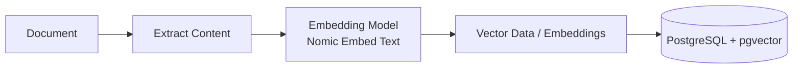
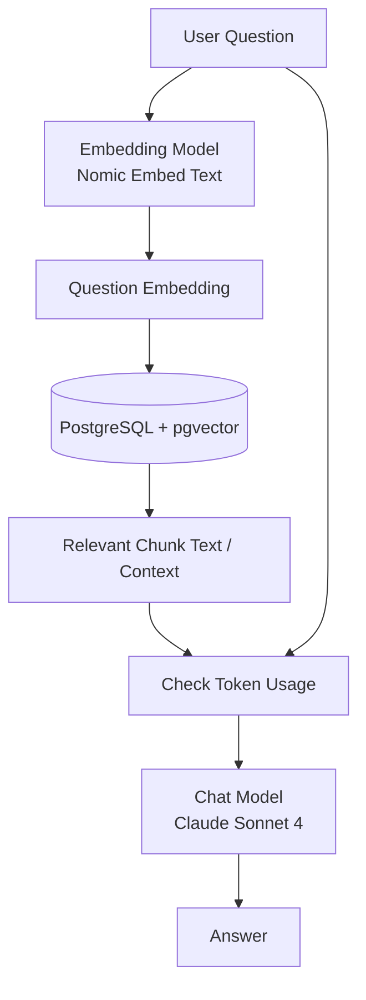
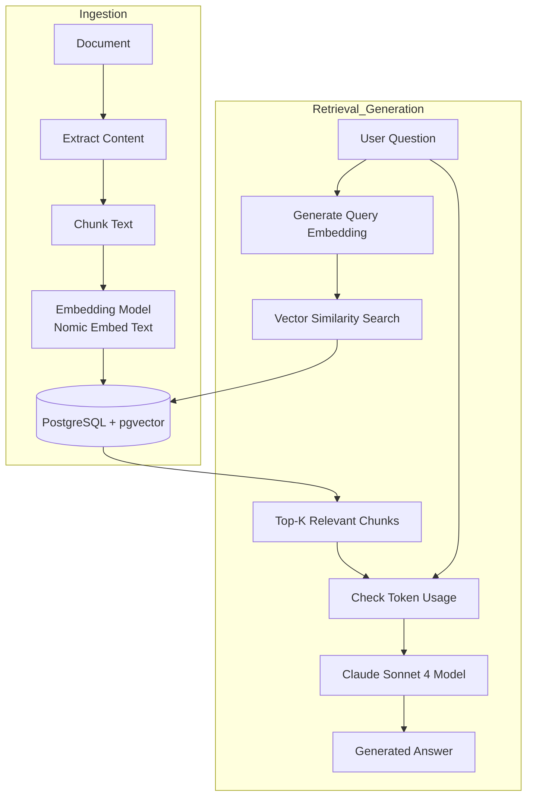

# test-app
Test Github repo

Test comment 1

Test comment 2

## Document Ingestion Flow

```mermaid
flowchart LR
    A[Document] --> B[Extract Content]
    B --> C[Embedding Model<br/>Nomic Embed Text]
    C --> D[Vector Data / Embeddings]
    D --> E[(PostgreSQL + pgvector)]
```

## Question Answering Flow

```mermaid
flowchart TD

    A[User Question]
    A --> B[Embedding Model<br/>Nomic Embed Text]

    B --> C[Question Embedding]

    C --> D[(PostgreSQL + pgvector)]

    D --> E[Relevant Chunk Text / Context]

    E --> F[Check Token Usage]
    A --> F

    F --> G[Chat Model<br/>Claude Sonnet 4]

    G --> H[Answer]
```

## End-to-End Architecture

```mermaid
flowchart TD

    subgraph Ingestion
        A[Document]
        B[Extract Content]
        C[Chunk Text]
        D[Embedding Model<br/>Nomic Embed Text]
        E[(PostgreSQL + pgvector)]

        A --> B
        B --> C
        C --> D
        D --> E
    end

    subgraph Retrieval_Generation
        F[User Question]
        G[Generate Query Embedding]
        H[Vector Similarity Search]
        I[Top-K Relevant Chunks]
        J[Check Token Usage]
        K[Claude Sonnet 4 Model]
        L[Generated Answer]

        F --> G
        G --> H
        H --> E
        E --> I
        I --> J
        F --> J
        J --> K
        K --> L
    end
```

