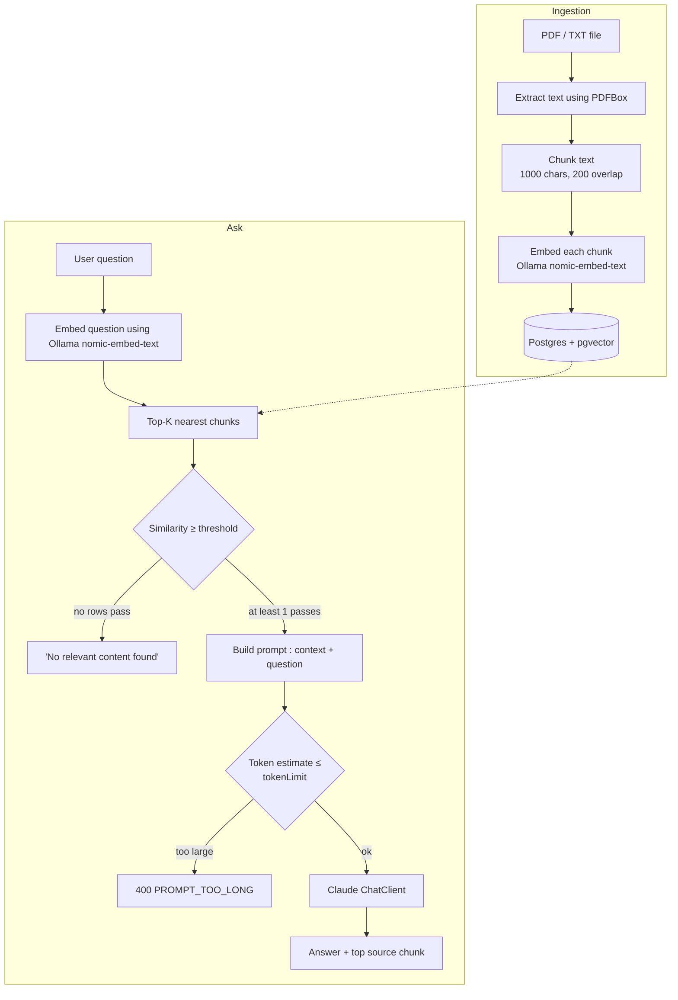

# RAG Demo — Spring AI + Claude + pgvector

A Retrieval-Augmented Generation (RAG) proof of concept: upload PDF/TXT documents, they get chunked and embedded into PostgreSQL (`pgvector`), and questions are answered by Claude using only the retrieved, relevance-filtered chunks as context.

## Tech Stack

| Layer | Technology |
|---|---|
| Language / Runtime | Java 21 |
| Framework | Spring Boot 4.1.0, Spring AI 2.0.0 |
| LLM | Anthropic Claude (model selected via `CLAUDE_MODEL` env var) |
| Embedding model | `nomic-embed-text` (768-dim), served by Ollama |
| Vector store | PostgreSQL 16 + `pgvector` extension |
| PDF parsing | Apache PDFBox |
| API docs | springdoc-openapi (Swagger UI) |
| Build | Maven |

## Architecture

**ingestion** (upload → chunk → embed → store) and **ask** (embed question → similarity search → filter → prompt → Claude).




## Setup


## Prerequisites

- Java 21+
- Maven 3.9+
- Docker Desktop (for Postgres/pgvector and Ollama)
- An Anthropic API key

### 1. Clone and configure

```bash
git clone <repository-url>
cd clauderag-demo
```

Create a `.env` file in the project root

```env
CLAUDE_MODEL=claude-sonnet-5
CLAUDE_MODEL_INPUT_TOKEN_LIMIT=200000
ANTHROPIC_API_KEY=<your-anthropic-api-key>
APP_IMAGE=claude-rag-app-v1
```


### 2. Start Postgres (pgvector) + Ollama

```bash
docker compose up -d postgres ollama
```

This starts:
- `rag-postgres` — Postgres 16 with the `vector` extension, auto-running [`docker/init.sql`](docker/init.sql) to create `document_chunks_claude_llm (id, file_name, chunk_text, embedding vector(768))`
- `ollama` — embedding model runtime
- `pgadmin` (optional, also included) at [http://localhost:8080](http://localhost:8080)

### 3. Pull the embedding model into Ollama

```bash
docker exec -it ollama ollama pull nomic-embed-text
```

(If running Ollama natively instead of via Docker: `ollama pull nomic-embed-text`, and point `spring.ai.ollama.base-url` at `http://localhost:11434`.)

### 4. Run the application

**Option A — local dev (recommended for iterating):**

```bash
mvn spring-boot:run
```

Reads `.env` values as env vars (export them, or use an IDE run config / `dotenv` plugin) and connects to `localhost:5432` / `localhost:11434` as configured in [`application.yml`](src/main/resources/application.yml).

**Option B — fully containerized:**

```bash
mvn clean package -DskipTests
docker build -t claude-rag-app-v1 .
docker compose up -d
```

The `app` service in [`docker-compose.yml`](docker-compose.yml) runs the image named by `APP_IMAGE`, so it must be built first (there's no `build:` block in the compose file). The app is exposed on **host port 8081** (mapped to container port 8080).

### 5. Verify

- Swagger UI: `http://localhost:8080/swagger-ui/index.html` (or `:8081` when running via Docker Compose)
- Health check: upload a document, then ask a question (below).

## Configuration reference

| Property / env var | Default | Purpose |
|---|---|---|
| `app.table-name` | `document_chunks` (overridden to `document_chunks_claude_llm` in `application.yml`) | pgvector table used for both ingestion and retrieval |
| `app.similarity-threshold` | `0.75` | Minimum cosine similarity (0–1) a chunk must have to be used as context |
| `app.input-token-limit` / `CLAUDE_MODEL_INPUT_TOKEN_LIMIT` | — | Max estimated prompt tokens before rejecting with `PROMPT_TOO_LONG` |
| `CLAUDE_MODEL` | — | Anthropic model id (e.g. `claude-sonnet-5`) |
| `ANTHROPIC_API_KEY` / `API_KEY` | — | Anthropic API key |
| `spring.ai.ollama.base-url` | `http://ollama:11434` | Ollama endpoint for embeddings |

## REST API

### Upload a document

```http
POST /api/upload
Content-Type: multipart/form-data

file: <your-file.pdf | .txt>
```

```bash
curl -F "file=@handbook.pdf" http://localhost:8080/api/upload
```

Response:

```text
Document uploaded Successfully
```

Only `application/pdf` and `text/plain` are accepted; anything else returns `400 UNSUPPORTED_FILE_TYPE`.

### Ask a question

```http
GET /api/ask?q=What is Retrieval Augmented Generation?
```

```bash
curl "http://localhost:8080/api/ask?q=What%20is%20Retrieval%20Augmented%20Generation%3F"
```

## Sample query and response

**Request**

```bash
curl "http://localhost:8080/api/ask?q=What is Retrieval Augmented Generation?"
```

**Response** (`200 OK`, shape from [`AskResponse`](src/main/java/com/poc/rag/rag_demo/dto/AskResponse.java)):

```json
{
  "answer": "Retrieval-Augmented Generation (RAG) is a technique that combines vector-based retrieval with a large language model. Relevant chunks are retrieved from a knowledge base using vector similarity search and supplied as context to the model before it generates an answer, which improves factual accuracy and reduces hallucination.",
  "sourceChunk": "Retrieval-Augmented Generation (RAG) combines information retrieval with large language models. Relevant document chunks are retrieved and added to the prompt before answer generation..."
}
```

**No relevant match** (all 3 nearest chunks scored below `app.similarity-threshold`):

```json
{
  "answer": "No relevant content found",
  "sourceChunk": null
}
```

**Prompt too large** (`400 BAD REQUEST`, shape from [`ErrorResponse`](src/main/java/com/poc/rag/rag_demo/dto/ErrorResponse.java)):

```json
{
  "code": "PROMPT_TOO_LONG",
  "message": "Input exceeds model limit."
}
```

## Chunking strategy

- **Chunk size:** 1000 characters
- **Overlap:** 200 characters

Smaller, overlapping chunks keep embeddings focused (better similarity search) while preserving context across chunk boundaries. See [`DocumentService.chunkText`](src/main/java/com/poc/rag/rag_demo/service/DocumentService.java).

## Author

**Baby Satheeshkumar** — Senior Lead Engineer
